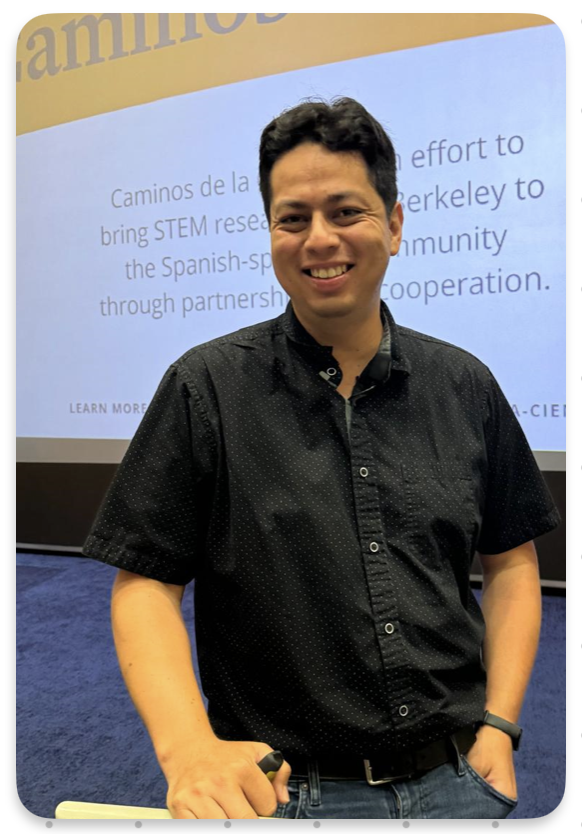
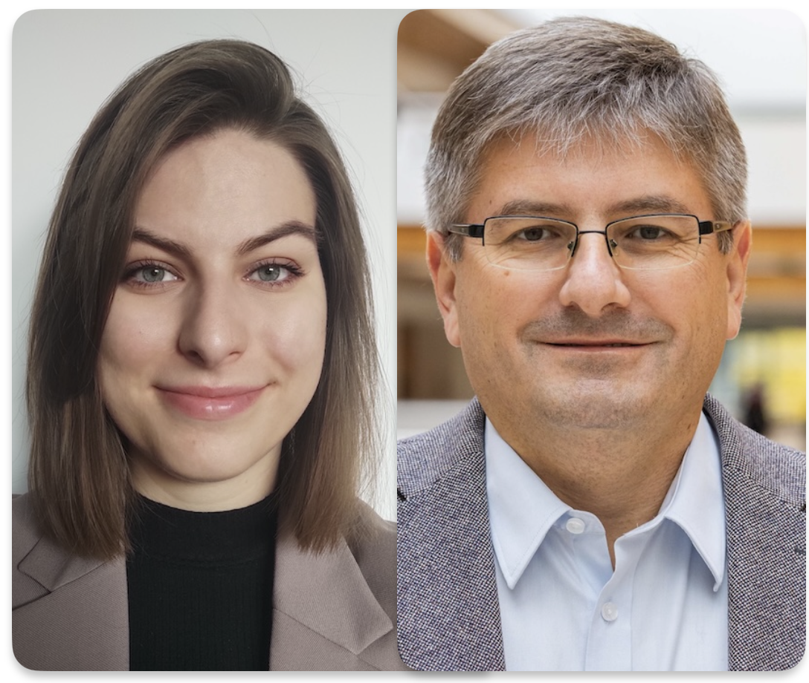

[What is NeuroGDA?](whatis.md) | [Previous editions](previous.md)

## Next seminar: 3rd edition

### When

April 14th 2025, 14:30

### Where 

Room 2/DD/03, Centrum Medycyny Inwazyjnej (CMI), Uniwersyteckie Centrum Kliniczne, Smoluchowskiego 17 [look up on Google Maps](https://maps.app.goo.gl/tLA2EAiwJDySVomu9)

### Agenda

- **Natalia Mańkowska, Paweł Winklewski (Medical University of Gdańsk)** - _"Flickering light: from diving and hyperbaric medicine to the metaverse"_
- **David R. Quiroga Martinez (University of Copenhagen)** - _"The neuronal dynamics of cognition: Insights from music, imagination and invasive brain recordings"_

**David Quiroga Martinez** is a neuroscientist studying auditory working memory and imagination. He tries to understand how our brains can mentally hold and manipulate sounds, giving rise to our remarkable mind’s ear. He uses a combination of invasive (intracranial EEG) and non-invasive (M/EEG) techniques to register the activity of the brain while people listen and imagine musical sound sequences. His hope is that these recordings will give us valuable clues about the neural mechanisms that allow auditory imagination, potentially leading to a better understanding of abnormal imagery in psychiatric disorders and applications in brain-computer interfaces. After a few years as a postdoc at UC Berkeley, he started a cognitive intracranial EEG research program at University of Copenhagen.

**Paweł Winklewski**, MD, PhD, Prof, is the Head of the Department of Neurophysiology, Neuropsychology and Neuroinformatics at the MUG. His greatest achievement to date has been building an ambitious and interdisciplinary team at the forefront of neuroscience. **Natalia Mańkowska**, M.A., is a psychologist working at the Department of Neurophysiology, Neuropsychology and Neuroinformatics at the MUG. Her research focuses on flickering light as a new stimulus that has recently appeared in human evolution. She investigates how it is connected to our thinking and behavior, while also looking into how the brain processes this light.
