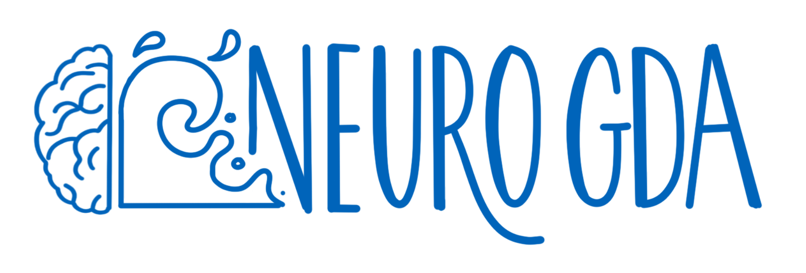

## Next seminar

### When

April 14th 2025, 14:30

### Where 

Room 2/DD/03, Centrum Medycyny Inwazyjnej (CMI), Uniwersyteckie Centrum Kliniczne, Smoluchowskiego 17 [look up on Google Maps](https://maps.app.goo.gl/tLA2EAiwJDySVomu9)

### Agenda

- **Natalia Mańkowska, Paweł Winklewski (Medical University of Gdańsk)** - _"Flickering light: from diving and hyperbaric medicine to the metaverse"_
- **David R. Quiroga Martinez (University of Copenhagen)** - _"The neuronal dynamics of cognition: Insights from music, imagination and invasive brain recordings"_

**David Quiroga Martinez** is a neuroscientist studying auditory working memory and imagination. He tries to understand how our brains can mentally hold and manipulate sounds, giving rise to our remarkable mind’s ear. He uses a combination of invasive (intracranial EEG) and non-invasive (M/EEG) techniques to register the activity of the brain while people listen and imagine musical sound sequences. His hope is that these recordings will give us valuable clues about the neural mechanisms that allow auditory imagination, potentially leading to a better understanding of abnormal imagery in psychiatric disorders and applications in brain-computer interfaces. After a few years as a postdoc at UC Berkeley, he started a cognitive intracranial EEG research program at University of Copenhagen.

**Paweł Winklewski**, MD, PhD, Prof, is the Head of the Department of Neurophysiology, Neuropsychology and Neuroinformatics at the MUG. His greatest achievement to date has been building an ambitious and interdisciplinary team at the forefront of neuroscience. **Natalia Mańkowska**, M.A., is a psychologist working at the Department of Neurophysiology, Neuropsychology and Neuroinformatics at the MUG. Her research focuses on flickering light as a new stimulus that has recently appeared in human evolution. She investigates how it is connected to our thinking and behavior, while also looking into how the brain processes this light.

# What is NeuroGDA?

NeuroGDA is an initiative to bring together and foster collaboration between people doing research in all areas of neuroscience within the Tricity area. Our plan is to establish a series of monthly seminars where people could present their work, meet colleagues from different departments and institutions, network and share ideas.

## What’s the format?
We intend to organize one in-person meeting per month. The meeting would start with one or two talks, presenting research by individuals or groups. This would be followed by an informal part, with time to mingle and network. Everybody is encouraged to present - if you would like to have a talk at NeuroGDA, please book a date with the organizers. The seminars will be held in English to include the growing international community of researchers and trainees.

## What’s the scope?
Neuroscience is an interdisciplinary endeavor, bringing together researchers from biology, medicine, psychology, physics, computational sciences, AI and more. Society for Neuroscience (SfN) meetings are a great example of this interdisciplinary approach. If your work fits into one of SfN [Themes and Topics](https://www.sfn.org/meetings/neuroscience-2025/call-for-abstracts/themes-and-topics), it is also within the scope of NeuroGDA.

## Who’s invited?
Everyone is invited! The seminars are open to the public. That being said, we wish for these meetings to be useful to working researchers, so the talks would necessarily be more technical (as in scientific conferences).

## Who’s behind it?
The idea for NeuroGDA came from a discussion between [Ola Rutkowska](https://rutkowskalab.gumed.edu.pl) and [Krzysztof Basiński](https://anl.gumed.edu.pl) at the Medical University of Gdańsk. However, we would gladly share the organizational burden with other people. If you wish to help us out (especially if you’re at another university), feel free to contact us!

