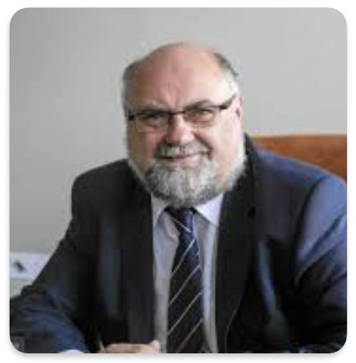
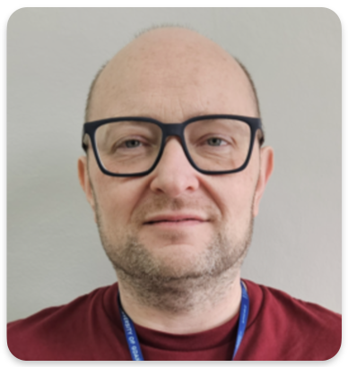
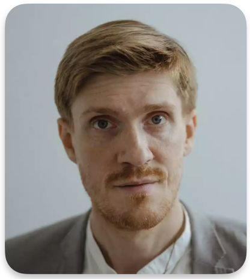

## Second edition

March 19th 2025, 14:30 - 15:30, Room 2/DD/03, Centrum Medycyny Inwazyjnej (CMI), Uniwersyteckie Centrum Kliniczne, Smoluchowskiego 17

- **Grzegorz Węgrzyn** - _"Autophagy stimulation as a potential method for treatment of neurodegeneration diseases"_
- **Krzysztof Pietruczuk** - _"Psychoneuroimmunology and neuroinformatics in studying mood disorders: from inflammation to neurophysiological modelling"_

**Grzegorz Węgrzyn** is a professor of biological sciences, Corresponding member of Polish Academy of Sciences, and Polish Academy of Learning, Deputy President of the Council for Scientific Excellence. Research in genetics and molecular biology. Author of over 500 scientific publications, cited in the literature over 13,000 times. Supervisor of 62 doctoral theses. Winner of national and international scientific awards.

**Krzysztof Pietruczuk** is a researcher combining neuroscience, immunology and mathematical modelling in the context of mood disorders and neurodegenerative diseases. His work focuses on the influence of the immune system on the pathogenesis of depression and bipolar affective disorder, with a particular focus on mechanisms of drug resistance and delayed effects of antidepressants. He is currently directing the newly established Laboratory of Psychoneuroimmunology and Neuroinformatics.

## First edition

February 5th 2025, 14:30 - 15:30, Room 2/DD/03, Centrum Medycyny Inwazyjnej (CMI), Uniwersyteckie Centrum Kliniczne, Smoluchowskiego 17

- Introduction by the organisers
- Lab presentation – **Michał Kucewicz**, [Brain and Mind Electrophysiology Laboratory](https://brainmindlab.com), Gdańsk Tech
- Informal discussion

**Michal Kucewicz** is the founder of the Brain & Mind Electrophysiology (BME) lab at the BioTechMed Center of the Gdansk University of Technology in Poland. BME lab focuses on studying the brain activities underlying memory and higher cognitive functions with technologies for intracranial multi-electrode recordings and stimulation mainly in epilepsy patients. The goal of this research is to discover the electrophysiological substrates of engrams and the human mind to develop neuromodulation therapies for restoring these in epilepsy, dementias, psychiatric and other brain diseases.